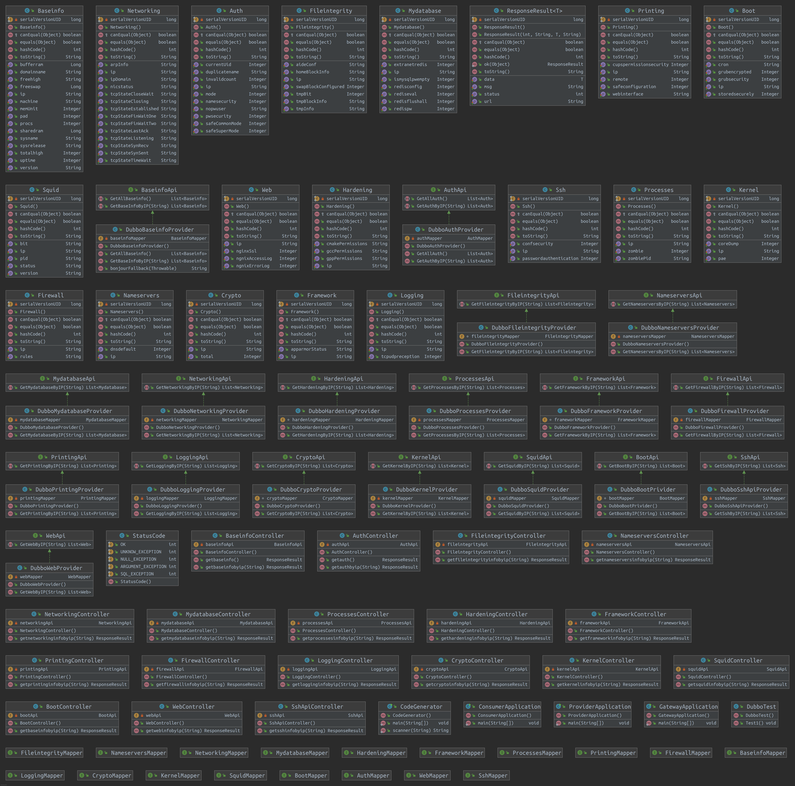

## 项目结构

```bash
➜  LY-control tree -L 1
.
├── common
├── LY-api
├── LY-consumer
├── LY-gateway
├── LY-model
├── LY-provider
└── pom.xml
6 directories, 1 file
```

- common:定义常用类和方法，如返回值结构，状态码等等
- LY-api：定义各个模块常用函数接口
- LY-consumer：服务消费者
- LY-gateway：网关服务
- LY-model：各个模块基本结构
- LY-provider：服务生产者

## 详细结构


