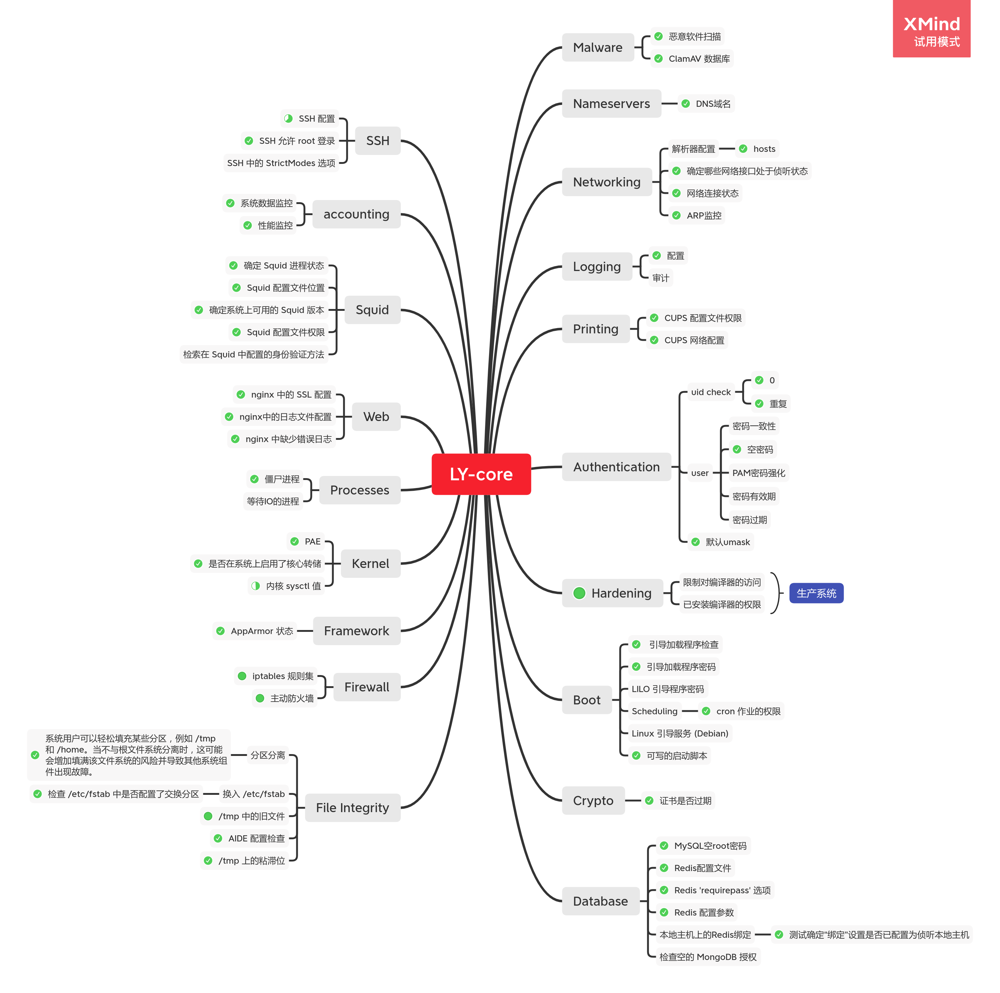

[toc]

## **Ly-core[文档](./html/index.html)**

## 核心功能



## 功能实现概述

在做安全检测时，**大部分工作用于对配置文件的解析**，在核心功能模块中，主要定义了**两个静态函数**去做配置文件的解析：

- KMPsearch

```c++
bool Utils::KMPsearch(const string &text,const string &pattern){
    int tLen = text.size();
	int pLen = pattern.size();
	int i = 0;
	int j = 0;
	while (i < tLen && j < pLen){
        if (text[i] == pattern[j]){
			i++;
			j++;
		}else{
			i = i - j + 1;
			j = 0;
		}
	}
	if (j == pLen)
		return true;
	else
		return false;
}
```

- executeCMD

```c++
void Utils::executeCMD(const char *cmd,char *res){
    char buf_ps[10000];   
    char ps[10000]={0};   
    FILE *ptr;   
    strcpy(ps, cmd);   
    if((ptr=popen(ps, "r"))!=NULL){   
        while(fgets(buf_ps, 10000, ptr)!=NULL){   
           strcat(res, buf_ps);   
           if(strlen(res)>10000)   
               break;   
        }   
        pclose(ptr);   
        ptr = NULL;   
    }   
    else{   
        spdlog::critical("popen {} error",ps);
    }
}
```

## 功能实现详细

### Accounting

- 数据结构

```c++
struct utsname sysuname;
struct sysinfo info;
```

- 关键函数

```text
uname - print system information
sysinfo - return system information
```

---

### Auth

- 函数
  - CheckIsOnlyUser
  - CheckNoPwUser
    - 通过解析**/etc/passwd**文件实现
  - CheckUmask
    - 调用```umask```函数实现

---

### Boot

- 函数
  - CheckGrubBootLoader
    - 校验**/boot/grub/grub.cfg**是否是grub-mkconfig模板(MD5)
  - CheckAuthBoot
    - 解析**/boot/grub/grub.cfg**文件
  - CheckCron
    - 解析**/etc/crontab**文件

---

### Crypto

- 函数

  - CheckCerts

    - 读取**/etc/ssl/certs**目录所有文件，针对所有文件执行命令：

      ```bash
      string cmd = "openssl x509 -in /etc/ssl/certs/" + string(ptr->d_name)+" -noout -enddate | awk '{print $4}'";
      ```

---

### Database

- 函数

  - CheckNullPass

    - 空密码登录

  - CheckDangerousCMD

    - 解析**/etc/redis/redis.conf**配置，高危配置：

    ```tex
    rename-command FLUSHALL
    rename-command CONFIG
    rename-command EVAL
    ```
    
   - CheckRedisPass
  
     - 解析**/etc/redis/redis.conf**是否配置了`requirepass`属性
  
  - CheckIntranetAccess
  
    - 解析**/etc/redis/redis.conf**是否配置了`bind 127.0.0.1`

---

### FileIntegrity

- 函数：

  - CheckNecessaryBlock

    - 执行命令：

    ```bash
    df -h /home
    df -h /tmp
    ```

  - CheckSwap

    - 解析**/etc/fstab**是否配置了`/swapfile`属性

  - CheckTmp

    - 执行命令：

    ```bash
    find /tmp -type f
    ```

  - CheckAIDE

    - 解析**/etc/aide/aide.conf**是否配置

  - TmpStickybit

    - 执行命令：

    ```bash
    ls -l -d /tmp | awk '{print $1}'
    ```

    再校验输出

----

### Firewall

- 函数

  - GetIptabelse

    - 执行命令获取规则

    ```bash
    sudo iptables -L
    ```

---

### Framework

- 函数

  - apparmor_status

    - 执行命令获取apparmor状态

    ```bash
    sudo apparmor_status
    ```

---

### Hardening

- 函数

  - CheckGCC
    - 执行命令获取版本以及权限信息

  ```bash
  gcc --version | grep \"gcc\" | awk '{print $4}'
  ls -la /bin/gcc | awk '{print $1}'
  ```

  - CheckGPP
    - 执行命令获取版本以及权限信息

  ```bash
  g++ --version | grep \"g++\" | awk '{print $4}'
  ls -la /bin/g++ | awk '{print $1}'
  ```

  - CheckCMAKE
    - 执行命令获取版本以及权限信息

  ```bash
  cmake --version | head -n 1 | awk '{print $3}'
  ls -la /bin/cmake | awk '{print $1}'
  ```

---

### Kernel

- 函数

  - CheckPAE
    - 解析**/proc/cpuinfo**`pae`信息
  - CheckCoreDumpOK
    - 执行命令检测

  ```bash
  ulimit -c
  ```

---

### Logging

- 函数

  - AuditConfiguration

    - 解析**/etc/rsyslog.conf**配置

    ```text
    #input(type=\"imudp\" port=\"514\")
    #input(type=\"imtcp\" port=\"514\")
    ```

---

### Malware

- 函数

  - UpdateDataBase
    - 执行命令

  ```text
  sudo freshclam
  ```

  - FullScan
    - 执行命令

  ```bash
  systemctl start clamav-freshclam
  clamscan -r -i --max-scansize=4000M --max-filesize=4000M /
  ```

  - BinScan
    - 执行命令

  ```bash
  systemctl start clamav-freshclam
  clamscan -r -i --max-scansize=4000M --max-filesize=4000M /bin/
  ```

---

### Nameservers

- 函数
  - CheckDNS
    - 解析**/etc/resolv.conf**是否匹配`nameserver 127.0.0.53`

---

### NetWorking

- 函数

  - HostsParsing
    - 解析**/etc/hosts**
  - NicStatus
    - 执行命令

  ```bash
  ifconfig
  ```

  - ss
    - 执行命令

  ```bash
  ss -tan state syn-sent
  ss -tan state syn-recv
  ss -tan state listening
  ss -tan state established
  ss -tan state fin-wait-1
  ss -tan state close-wait
  ss -tan state fin-wait-2
  ss -tan state time-wait
  ss -tan state last-ack
  ss -tan state closing
  ```

  - arp
    - 执行命令

  ```bash
  arp -vn
  ```

---

### Printing

- 函数

  - CheckCUPSPermissions
    - 执行命后校验权限

  ```bash
  ls -la /sbin/cupsfilter | awk '{print $1}'
  ```

  - CheckCUPSRemoteAccess
    - 解析配置文件**/etc/cups/cupsd.conf**是否匹配`Listen localhost:631`和`WebInterface No`

---

### Processes

- 函数

  - RetrievingZombieProcesses
    - 执行命令

  ```bash
  ps -A -ostat,ppid,pid,cmd | grep -e '^[Zz]' | awk '{print $2}'
  ```

---

### Squid

- 函数

  - CheckSquidStatus
    - 执行命令

  ```bash
  sudo systemctl status squid | grep -E \"Active\"
  sudo systemctl status squid | grep -E \"PID\"
  squid --version  | grep Version | awk '{print $4}'
  ls -la /etc/squid/squid.conf | awk '{print$1}'
  ```

---

### SSH

- 函数

  - AuditSSHConfig
    - 执行命令校验权限以及解析**/etc/ssh/ssh_config**配置`PasswordAuthentication`

  ```bash
  ls  -la /etc/ssh/ssh_config | awk '{print $1}'
  ```

---

### Web

- 函数
  - CheckNginxSSL
    - 解析**/etc/nginx/nginx.conf**是否配置`443 ssl`
  - CheckNginxLog
    - 解析**/etc/nginx/nginx.conf**是否配置`access_log`&`error_log`
