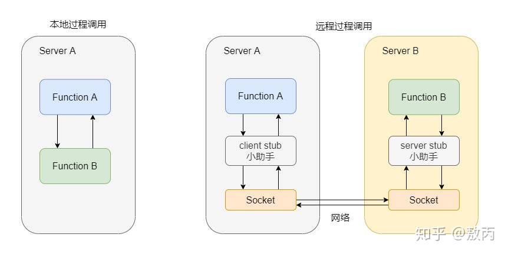

> dubbo官网：https://dubbo.apache.org/zh/

## 简介

Apache Dubbo 是一款微服务开发框架，它提供了 **RPC通信** 与 **微服务治理** 两大关键能力。

### 功能

- 服务发现
- 流式通信
- 负载均衡
- 流量治理
- …..

### 优点

- 开箱即用
  - 易用性高，如 Java 版本的面向接口代理特性能实现本地透明调用
  - 功能丰富，基于原生库或轻量扩展即可实现绝大多数的微服务治理能力
- 超大规模微服务集群实践
  - 高性能的跨进程通信协议
  - 地址发现、流量治理层面，轻松支持百万规模集群实例
- 企业级微服务治理能力
  - 服务测试
  - 服务Mock
- 云原生友好

## 概念与架构

### 服务发现

服务发现，即消费端自动发现服务地址列表的能力，是微服务框架需要具备的关键能力，借助于自动化的服务发现，微服务之间可以在无需感知对端部署位置与 IP 地址的情况下实现通信。

工作原理如下图：

- **服务提供者（Provider）**：暴露服务的服务提供方，服务提供者在启动时，向注册中心注册自己提供的服务。
- **服务消费者（Consumer）**: 调用远程服务的服务消费方，服务消费者在启动时，向注册中心订阅自己所需的服务，服务消费者，从提供者地址列表中，基于软负载均衡算法，选一台提供者进行调用，如果调用失败，再选另一台调用。
- **注册中心（Registry）**：注册中心返回服务提供者地址列表给消费者，如果有变更，注册中心将基于长连接推送变更数据给消费者
- **监控中心（Monitor）**：服务消费者和提供者，在内存中累计调用次数和调用时间，定时每分钟发送一次统计数据到监控中心

**调用流程:**

1. 服务容器负责启动，加载，运行服务提供者。
2. 服务提供者在启动时，向注册中心注册自己提供的服务。
3. 服务消费者在启动时，向注册中心订阅自己所需的服务。
4. 注册中心返回服务提供者地址列表给消费者，如果有变更，注册中心将基于长连接推送变更数据给消费者。
5. 服务消费者，从提供者地址列表中，基于软负载均衡算法，选一台提供者进行调用，如果调用失败，再选另一台调用。
6. 服务消费者和提供者，在内存中累计调用次数和调用时间，定时每分钟发送一次统计数据到监控中心。

### RPC 通信协议

RPC，Remote Procedure Call 即远程过程调用

简单的说本机上内部的方法调用都可以称为本地过程调用，而远程过程调用实际上就指的是你本地调用了远程机子上的某个方法，这就是远程过程调用。

网络间通信协议？

- HTTP + JSON

  - 优势：
    - HTTP 的语义和可扩展性能很好的满足 RPC 调用需求。
    - 通用性，HTTP 协议几乎被网络上的所有设备所支持，具有很好的协议穿透性。
  - 缺点：
    - 典型的 Request – Response 模型，一个链路上一次只能有一个等待的 Request 请求。会产生 HOL。
    - Human Readable Headers：性能差
- gRPC（基于HTTP2 和 Protobuf ）

  - 优点：
    - HTTP2 的协议简单，有 多路复用 / 流量控制能力
    - Protobuf 多语言跨平台二进制兼容能力
    - 基于协议本身的生态比较丰富，k8s，云原生
  - 缺点：
    - 强绑定 protobuf 的序列化方式，需要较高的学习成本和改造成本
- Triple（兼容 gRPC，HTTP2 作为传输层）

> https://dubbo.apache.org/zh/docs/concepts/rpc-protocol/

